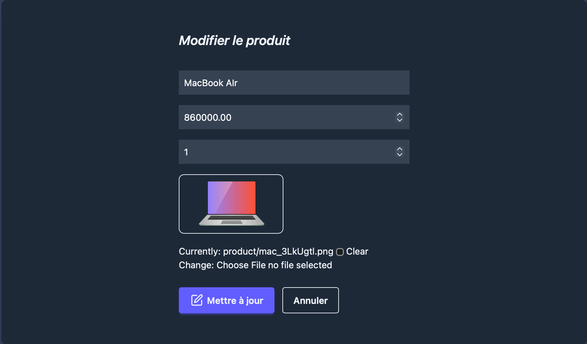

- **git clone https://github.com/OusmanHamit/DjangoYouTubeVideos.git**

- Se déplacer dans le dossier avec **cd nom_du_projet** que vs voulez
- **uv sync --group dev** ou bien **uv sync --group prod** si vouss etes en prod
- **uv sync** ou bien **uv sync --all-groups** pour tout installer

- **npm run tailwind:build**
- **uv run manage.py collectstatic --noinput**

- **uv run python manage.py runserver** 
- **npm run dev**
- **👍 + commentaire pour CHAQUE video**
- **✅**
---
 

- **Video 1 👉 https://youtu.be/B7TN8NM7rvQ**
- **Video 2 👉 https://youtu.be/Ey-Z7u-5oQQ**
- **Video 3 👉 https://youtu.be/1afKdUg-pNY**
- **Video 4 👉 https://youtu.be/0uFjLWntLCc**

---