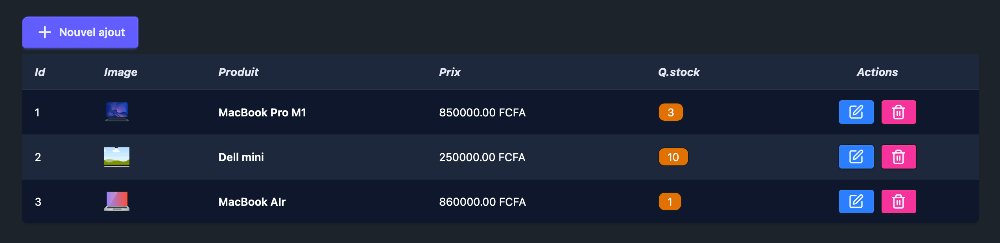
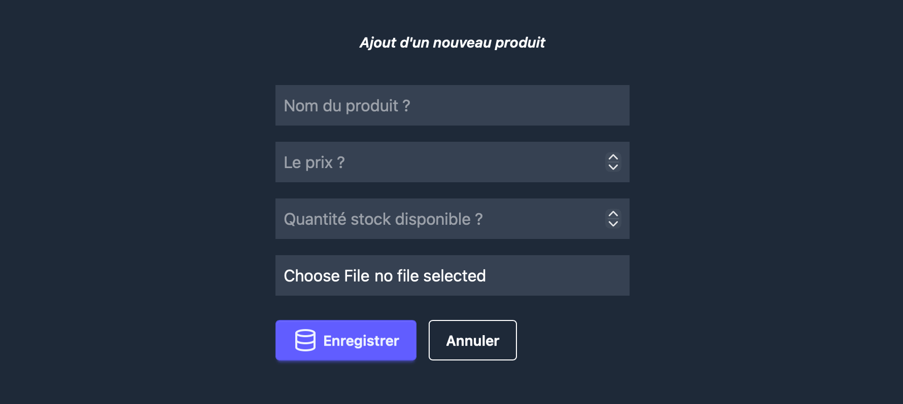
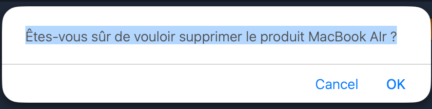

Les opérations **CRUD** (**Create**, **Read**, **Update**, **Delete**) de A à Z

- **git clone https://github.com/OusmanHamit/DjangoYouTubeVideos.git**

- Se déplacer dans le dossier avec **cd nom_du_projet** que vous voulez
- **uv sync --group dev** ou bien **uv sync --group prod** si vouss etes en prod
- **uv sync** ou bien **uv sync --all-groups** pour tout installer

- **npm run tailwind:build**
- **uv run manage.py collectstatic --noinput**

- **uv run python manage.py runserver** 
- **npm run dev**
- **👍 + commentaire pour CHAQUE video**
- **✅**
---

 
 

- **Video 5 👉 à venir ce mardi 23 à 9h GMT 

---